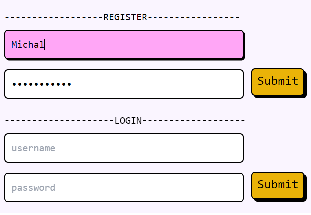

# chat-fullstack

<b>Fullstack chat app with login</b> 

 
<b>Tech stack: </b>  
Dev tools: Docker, Vite
Client: React, Tailwind 
Server: Node.js, Express, Postgres  
<b>INSATLL</b> 
<code>npm install</code> in both <code> ./node and ./front </code>
 
<b>DEVLOPMENT</b>

front: <code>make front</code> 
backend: <code>make back</code> or dockerized:<code>make dnode</code> 
dockerized database: <code>make db</code>
